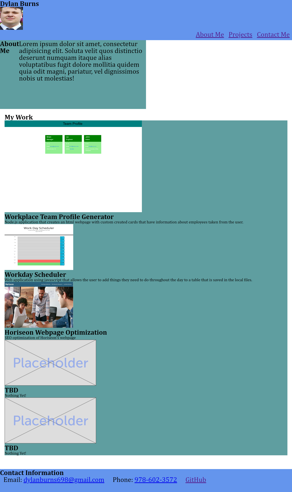

# <Dylan-Burns-WebDev-Portfolio>

## Description

Created simple html webpage for showcasing future projects and applications to potential employers. On the webpage when you click on the screenshot for a certain project then it will bring you to the applications github repository.

## Table of Contents (Optional)

- [Installation](#installation)
- [Usage](#usage)
- [Credits](#credits)
- [License](#license)

## Installation

No need for installation just visit https://dylanb0905.github.io/Dylans-WebDev-Portfolio/ to check out the portfolio.

## Usage


    ```md
    
    ```


## Credits

Built with html and css.
No collaborators at the moment

## License

MIT

---

## How to Contribute

The [Contributor Covenant](https://www.contributor-covenant.org/)

## Tests

If you want to test out the code of the application copy the repository from here: https://github.com/DylanB0905/Dylans-WebDev-Portfolio/
